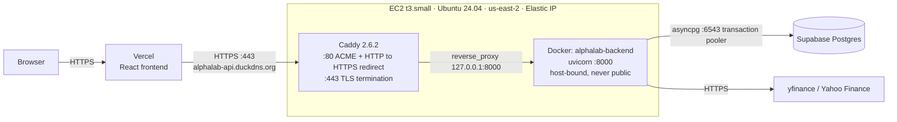

# AlphaLab

A full-stack trading analytics platform with real-time market data, technical indicators, interactive charts, a multi-ticker signal scanner, and a multi-strategy backtesting engine with benchmark comparison and parameter optimization.

## Live Demo

- **Frontend:** https://alphalab-lime.vercel.app
- **Backend API:** https://alphalab-backend.onrender.com/docs

## Features

- Real-time stock quotes with intraday price change and % move
- OHLCV historical data across multiple timeframes (1mo → max)
- Technical indicators — SMA20, SMA50, RSI, MACD calculated from scratch using pandas
- Signal engine with bullish/bearish trend detection, MACD crossovers, RSI extremes
- Multi-ticker scanner with composable signal filters
- Interactive price chart with SMA overlays, line/bar toggle, timeframe selector, percent change on hover, and a **two-point measurement tool** (click any two points to measure the % / $ / day move between them)
- Multi-strategy backtesting engine — RSI, MACD, combined RSI+MACD, and golden cross
- **Equity curve** with underwater drawdown shading, plus **buy & hold and SPY benchmark overlays** so you can see the strategy's margin over just holding the stock or the market
- **Risk & performance metrics** — total return (compounded), annualized return (CAGR), annualized Sharpe ratio, max drawdown, win rate
- Trade history with per-trade dollar P&L and running account balance
- **Parameter sweep** — backtest a grid of RSI thresholds in one request and view the results as a color-coded heatmap; click any cell to drill into its full backtest
- **Out-of-sample validation** — optimize on the first ~70% of history, then re-test the winners blind on the held-out ~30% with an honest HELD UP / LAGGED / DEGRADED verdict per combo
- **Shareable backtest URLs** — every run is encoded in the query string, so a link opens straight to that backtest or sweep
- **CSV export** of the full trade history
- **Per-user watchlist with auth** — sign in (Supabase email/password) and save a personal watchlist that persists across sessions, secured per-user with Row-Level Security
- **Saved backtest runs** — pin any single-run backtest (ticker, strategy, period, params, and its metrics) to your account and reload it into the backtester in one click, secured per-user with Row-Level Security
- **Redis market-data cache** — optional caching layer in front of yfinance (quotes 60s, history/indicators 15min) that speeds up repeat scans, backtests, and sweeps and cuts rate-limit pressure; fails open, with hit/miss stats at `/cache-stats`
- Bloomberg-style dark UI built in React + Tailwind

## Backtesting, Parameter Sweep & Validation

The backtester reports compounded total return, **CAGR**, an **annualized Sharpe ratio** (daily mark-to-market returns, 0% risk-free), max drawdown, and win rate, with a benchmark comparison against both buy & hold of the same ticker and SPY.

The **parameter sweep** runs the strategy across every combination of `buy_rsi` × `sell_rsi` in a single request — fetching price data once and re-running the in-memory simulation per combination — and renders them as a heatmap (green = better, red = worse) that can be colored by return, Sharpe, or win rate.

It's also an overfitting check, in two layers. First, the heatmap itself: a *region* of green cells points to a robust edge, while a single green cell in a field of red is a sign of curve-fitting to noise. Second, **out-of-sample validation**: one click splits the history ~70/30 by date, re-optimizes on the train window only, then runs the top combos blind on the test window they never saw — showing train vs. test return and Sharpe side by side with a verdict against the test window's buy & hold. Indicators are computed over the full series before slicing (rolling windows only look backward), so there's no lookahead leak. Metrics remain single-ticker with no transaction costs and a 0% risk-free rate, so even a validated "best" is a starting point for analysis, not a prediction.

## API Endpoints

- `GET /prices?tickers=AAPL,TSLA,NVDA` — latest closes for multiple tickers
- `GET /history/{ticker}?period=3mo` — OHLCV candle data across multiple timeframes
- `GET /quote/{ticker}` — price, day change, high/low, volume, market cap, PE ratio
- `GET /indicators/{ticker}?period=6mo` — SMA20, SMA50, RSI, MACD alongside daily closes
- `GET /signals/{ticker}` — boolean signal snapshot (bullish trend, RSI overbought/oversold, MACD crossover)
- `GET /scan?tickers=AAPL,NVDA,TSLA&bullish_trend=true` — multi-ticker scanner, filters by active signals
- `GET /backtest/{ticker}?strategy=rsi&period=2y&buy_rsi=30&sell_rsi=70` — backtest a strategy; returns metrics, equity curve, buy & hold and SPY benchmark curves, and full trade history
- `GET /sweep/{ticker}?strategy=rsi&period=2y` — run a `buy_rsi` × `sell_rsi` grid in one request, returning per-cell metrics and the best combination (rsi / combined strategies)
- `GET /validate/{ticker}?strategy=rsi&period=2y&split=0.7&top_n=3` — out-of-sample validation: sweep the train window, re-run the top combos on the held-out test window, and return train vs. test metrics per combo

**Protected** (require an `Authorization: Bearer <supabase-jwt>` header; each request is scoped to the signed-in user):

- `GET/POST /watchlist`, `DELETE /watchlist/{ticker}` — read, add to, and remove from the user's saved watchlist
- `GET/POST /saved-runs`, `DELETE /saved-runs/{id}` — list, save, and delete pinned backtest runs (ticker, strategy, period, params, metrics)

## Tech Stack

**Backend**
- Python + FastAPI
- yfinance + pandas
- asyncpg (Supabase Postgres) + PyJWT (Supabase auth verification)
- Redis (optional market-data cache)
- Uvicorn
- Docker

**Frontend**
- React
- Tailwind CSS
- Recharts

**Auth & persistence**
- Supabase (Postgres + Auth). The frontend authenticates with Supabase Auth and sends the JWT to FastAPI; the backend verifies it and reaches Postgres via the transaction pooler (asyncpg). Per-user tables (`watchlist`, `saved_runs`) also have Row-Level Security as defense-in-depth.

**Deployment**
- Backend: Render (Dockerized) — serves production traffic
- Backend: AWS EC2 + Caddy (Dockerized) — parallel deployment, see
  [Deployment & Infrastructure](#deployment--infrastructure)
- Frontend: Vercel

## Run Locally

**Backend:**
```bash
cd backend
source .venv/bin/activate
.venv/bin/python -m uvicorn main:app --reload
```

**Frontend:**
```bash
cd frontend
npm start
```

Then visit `http://127.0.0.1:8000/docs` for the interactive API docs or `http://localhost:3000` for the dashboard.

The frontend targets the deployed backend by default; set `REACT_APP_API_URL=http://localhost:8000` to point it at a local one.

## Supabase Setup (watchlist & auth)

Auth and persistence are backed by Supabase. The frontend signs in with Supabase
Auth and sends the JWT to FastAPI; the backend verifies it and talks to Postgres.

1. Create a free project at [supabase.com](https://supabase.com).
2. In the dashboard, open **SQL Editor → New query**, paste the contents of
   [`supabase/schema.sql`](supabase/schema.sql), and run it. This creates the
   `watchlist` and `saved_runs` tables plus their Row-Level Security policies.
3. **Frontend** — copy `frontend/.env.example` to `frontend/.env.local` and set
   `REACT_APP_SUPABASE_URL` and `REACT_APP_SUPABASE_ANON_KEY` (from **Project
   Settings → API**). The anon key is safe to ship in the browser.
4. **Backend** — copy `backend/.env.example` to `backend/.env` and set:
   - `DATABASE_URL` — the **Transaction pooler** string (port 6543,
     `*.pooler.supabase.com`) from **Project Settings → Database**. Not the
     direct `db.<ref>.supabase.co:5432` one (IPv6-only, fails on Render).
   - `SUPABASE_URL` — your project URL (`https://<ref>.supabase.co`). The
     backend fetches the project's public JWT signing keys from its JWKS
     endpoint to verify access tokens (Supabase's current asymmetric ES256/RS256
     keys). For an older project that still uses a legacy shared HS256 secret,
     set `SUPABASE_JWT_SECRET` instead — the backend detects the token's
     algorithm and handles either.
5. Verify the DB pipe once: `cd backend && python test_db.py` (with `DATABASE_URL`
   exported) should print the `saved_runs` row count.
6. (For local testing without email) Under **Authentication → Sign In / Providers
   → Email**, turn off **Confirm email** so sign-ups are usable immediately.

Both apps still run without these — the watchlist tab shows a "not configured"
note and the DB-backed routes return `503`, while every other feature is
unaffected.

## Redis Cache (optional)

Market-data fetches are cached in Redis when `REDIS_URL` is set on the backend:
quotes and prices for 60s, history and indicators for 15 minutes. Everything
downstream (scanner, backtests, sweeps, validation, compare) reuses the cached
data, so repeat runs skip the slow yfinance round-trips entirely. The cache
fails open — if Redis is down or unset, requests just fetch fresh data — and
`GET /cache-stats` reports hits, misses, and hit rate.

To enable on Render: create a **Key Value** instance (free 25MB tier), copy its
**Internal Key Value URL** (`redis://red-...:6379`), and set it as `REDIS_URL`
on the backend service. Locally: `brew install redis && brew services start
redis`, then `REDIS_URL=redis://localhost:6379`.

## Deployment & Infrastructure

Production traffic is served by **Render**. Alongside it runs a **self-managed
AWS EC2 deployment** of the same container behind a Caddy reverse proxy with
Let's Encrypt TLS — a parallel deployment, not the live path. This section
documents that EC2 setup: what it is, why it's built this way, how to operate
it, and what it doesn't do.

| | |
|---|---|
| Instance | t3.small (2 vCPU, 2 GB RAM), Ubuntu Server 24.04 LTS x86_64 |
| Region | us-east-2 (Ohio) |
| Storage | 20 GiB gp3, plus a 2 GB swapfile persisted via `/etc/fstab` |
| Address | Elastic IP `18.224.102.222` → `alphalab-api.duckdns.org` |
| Reverse proxy | Caddy 2.6.2, TLS via Let's Encrypt (`tls-alpn-01`), auto-renewing |
| Container | `alphalab-backend`, `--restart always`, uvicorn on `:8000` bound to the host |

The 2 GB swapfile is there because 2 GB of RAM is thin for a pandas workload —
a parameter sweep holds a full price history plus per-combination simulation
state, and swap is the difference between a slow request and an OOM-killed
container.

### Architecture



Security group inbound rules:

| Type | Port | Source | Why |
|---|---|---|---|
| SSH | 22 | My IP only | Admin access; never `0.0.0.0/0` |
| HTTP | 80 | `0.0.0.0/0` | ACME challenges + HTTP→HTTPS redirect |
| HTTPS | 443 | `0.0.0.0/0` | Public API surface |

**Port 8000 is deliberately absent from that table, and that absence is the
point of the diagram.** The container publishes `8000` on the host, so Caddy
can reach it over loopback, but the security group never admits it — the only
inbound edges crossing the instance boundary are `:80` and `:443`. The
application server is not reachable from the internet at all; every request
arrives through the proxy or not at all.

### Why EC2 rather than ECS/Fargate

This is one always-on container with no scaling requirement and no sibling
services to coordinate. Fargate would add a task definition, an execution IAM
role, and — to terminate TLS the managed way — an ALB, whose hourly cost alone
exceeds the instance this runs on. That's real machinery bought for zero
benefit at one container.

EC2 also bought two things worth having here: direct control of the proxy layer
(a Caddyfile on disk, edited and reloaded in place, rather than a listener-rule
graph), and full shell access — which is what made the TLS failure below
diagnosable rather than a matter of re-reading task logs.

The tradeoff is honest and it cuts the other way at scale: **this is a pet, not
cattle.** There is one instance in one AZ, patching is mine, and a host failure
is downtime. If this needed to scale or carry an availability target, the
answer is Fargate behind an ALB — or an ASG across AZs if the shell access
genuinely mattered — and the operational cost of orchestration would then be
buying something real.

### Why TLS terminates at the proxy

Uvicorn is an application server, not a hardened edge. Terminating TLS at Caddy
means:

- **Certificate lifecycle lives in one place.** Issuance, renewal, and the
  HTTP→HTTPS redirect are Caddy's job. The app never sees a certificate and
  never restarts on renewal.
- **One public process.** A single listener is the entire attack surface facing
  the internet, rather than exposing the application server directly.
- **The app stays portable.** Both deployments build from the same
  [`backend/Dockerfile`](backend/Dockerfile) precisely because the image knows
  nothing about TLS, hostnames, or certificates — Render terminates TLS at its
  own edge, Caddy does it here, and the container is unchanged either way.

### Secrets handling

`backend/.env` holds `DATABASE_URL` and `SUPABASE_URL` on the box and is
gitignored ([`.gitignore`](.gitignore)). The committed
[`backend/.env.example`](backend/.env.example) is the contract: every key
documented with where in the Supabase dashboard to find it, including why
`DATABASE_URL` must be the transaction pooler string on `:6543` rather than the
IPv6-only direct one. Values reach the process via `docker run --env-file` at
container start.

Two honest limitations:

1. **This is manual, file-based secret management.** Rotation means SSH'ing to
   the box and editing a file; there is no audit trail and no versioning. At any
   real scale this is AWS Secrets Manager or SSM Parameter Store, injected as a
   task/instance role rather than a file on disk.
2. **The image build does not currently exclude `.env`.** See Known Gaps — the
   `--env-file` injection is sound, but the Dockerfile's build context is not.

### Runbook

```bash
# deploy / redeploy
git pull
docker build -t alphalab-backend ./backend
docker stop alphalab && docker rm alphalab
docker run -d -p 8000:8000 --env-file backend/.env \
  --name alphalab --restart always alphalab-backend
```

```bash
# health
docker ps
docker logs alphalab --tail 50
curl -I https://alphalab-api.duckdns.org/docs
```

```bash
# proxy
sudo systemctl status caddy
sudo journalctl -u caddy --no-pager | tail -30
```

`GET /cache-stats` reports the cache's view of itself and is the quickest way
to confirm which backend you're actually talking to: EC2 answers
`{"enabled": false}` because `REDIS_URL` is unset there, while Render reports
live hit/miss counters.

### Debugging log: the ACME failure

Worth recording because the symptom pointed nowhere near the cause.

**Symptom.** Caddy started cleanly and `systemctl status caddy` reported
`active (running)`. No certificate was ever issued, and HTTPS requests failed.

**Error.** Caddy's log showed the challenge failing:

```
Timeout during connect (likely firewall problem)
```

…while fetching `/.well-known/acme-challenge/...`.

**Diagnosis.** Let's Encrypt does not validate domain ownership by taking your
word for it over an outbound connection — it connects *inbound*, to port 80, to
prove you control the host the DNS name points at. The EC2 security group
allowed SSH only: the launch wizard's "Allow HTTP traffic" checkbox defaults to
unchecked, so nothing on 80 or 443 was ever admitted.

**Fix.** Added inbound 80 and 443 to the security group. No restart or manual
retrigger was needed — Caddy's own ACME retry loop picked it up on its next
attempt and the certificate issued.

**Takeaway.** A process being healthy locally says nothing about whether it is
reachable. Two independent layers have to agree — the host firewall (the
security group) and the application listener — and `active (running)` only ever
reports on the second. The error string said "firewall problem" and it was
precisely right; the instinct to distrust it and go re-read the Caddyfile cost
most of the debugging time.

One incidental mercy: after repeated failures Caddy fell back to Let's
Encrypt's **staging** endpoint, so the retries burned staging quota instead of
the production rate limit — Let's Encrypt caps failed validations per account,
per hostname, per hour, and a retry loop against a closed port will exhaust
that budget quickly. Worth knowing before you lock yourself out of issuance.

### Known gaps

Stated plainly, because a deployment that hides these is harder to trust than
one that names them:

- **No Redis on EC2.** `REDIS_URL` is unset there, so the cache is disabled
  entirely and every market-data request goes to yfinance — slower, and more
  rate-limit exposure. Render's deployment has it. The cache also *fails open*
  by design ([`backend/app/cache.py`](backend/app/cache.py)): a Redis that is
  down or slow costs one ~1s timeout, then gets skipped for 30s, and requests
  keep serving fresh data rather than erroring.
- **Render is still production.** `frontend/src/config.js` defaults to the
  Render host, and no production environment variable points at EC2. The EC2
  path is exercised directly (the API answers over HTTPS at its own hostname);
  wiring the *frontend* to it is a preview-scope change, documented below.
- **The Docker build context is not filtered.** There is no `.dockerignore`, so
  `COPY . .` copies the entire `backend/` directory into the image — including
  the local `.venv/` (~150 MB of a ~151 MB context) and, critically,
  **`backend/.env` if it is present on the build host, which it is on EC2**.
  `.gitignore` does not apply to Docker build contexts. The running container
  gets its secrets correctly via `--env-file`, but the image built on the box
  also contains a copy of them in a layer. A two-line `.dockerignore`
  (`.venv/`, `.env`) fixes both the bloat and the leak; until it lands, the
  image must be treated as sensitive and never pushed to a registry.
- **CORS is `allow_origins=["*"]`.** Tolerable here rather than correct: auth is
  a Supabase JWT in the `Authorization` header rather than a cookie, and
  `allow_credentials=False`, so a browser will not attach ambient credentials
  and the wildcard widens no CSRF surface. It should still be narrowed to the
  known Vercel origins — the wildcard is a default nobody chose, and defaults
  that happen to be safe stop being safe when the auth model changes.
- **RLS is bypassed on the backend path.** The pooler connects as the `postgres`
  role, so Row-Level Security does not constrain it; per-user scoping is
  enforced in application code via the `get_current_user_id` dependency
  ([`backend/app/auth.py`](backend/app/auth.py)). The RLS policies in
  [`supabase/schema.sql`](supabase/schema.sql) remain as defense-in-depth for
  direct client access, but on this path a missing `WHERE user_id = ...` is a
  data leak, not a caught error.
- **Single instance, single AZ.** No redundancy and no health-check-driven
  recovery beyond Docker's `--restart always`, which restarts a crashed
  container but cannot detect one that is up and serving errors.
- **Deploys are manual over SSH.** No CI/CD to the box; the runbook above *is*
  the pipeline. Nothing verifies that what's running matches `origin/main`.

### Verifying the frontend against EC2 without touching production

The frontend reads its backend from `REACT_APP_API_URL`
([`frontend/src/config.js`](frontend/src/config.js)), which Vercel scopes per
environment — so the EC2 backend can be exercised through the real UI without
altering the production variable:

1. Vercel → **Settings → Environment Variables → `REACT_APP_API_URL`**.
2. Add a value scoped to **Preview only**:
   `https://alphalab-api.duckdns.org`. Leave the Production value untouched.
3. Push a branch and open the generated preview URL.
4. Run a backtest and load a chart.
5. **DevTools → Network** — confirm the XHRs address the duckdns host and
   return `200`.

Because production and preview resolve different values for the same variable,
this exercises the full path against EC2 while `alphalab-lime.vercel.app`
continues to serve from Render throughout.

<!--
Screenshots — capture into docs/ and uncomment:


*`/docs` on alphalab-api.duckdns.org, padlock visible — Caddy-terminated TLS.*


*Inbound 22/80/443 only. Port 8000 is absent.*


*Vercel preview issuing 200s against the duckdns host.*


*`docker ps` — alphalab-backend up with `--restart always`.*
-->

## Status

**v1.1.1** — v1.0.0 (tagged) shipped the feature-complete platform: real-time
data, indicators, charts, the scanner, the multi-strategy backtester with
parameter sweep and out-of-sample validation, and per-user auth with a saved
watchlist and saved backtest runs, all wired through FastAPI + Supabase and
deployed. v1.1.0 added the optional Redis market-data cache. v1.1.1 hardens
the market-data layer after a production incident: `/quote` now falls back to
Yahoo's chart API when the rate-limit-prone quoteSummary API fails, NaN rows
from the current (incomplete) trading day can no longer 500 `/history` or get
pinned in the cache, and backend errors reach the browser as JSON with CORS
headers so the UI reports the real failure instead of guessing the backend is
down.
