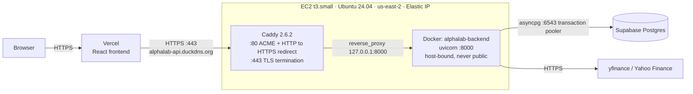

# AlphaLab

A full-stack trading analytics platform with real-time market data, technical indicators, interactive charts, a multi-ticker signal scanner, and a multi-strategy backtesting engine with benchmark comparison and parameter optimization.

## Live Demo

- **Frontend:** https://alphalab-lime.vercel.app
- **Backend API:** https://alphalab-backend.onrender.com/docs

## Features

- Real-time stock quotes with intraday price change and % move
- OHLCV historical data across multiple timeframes (1mo → max)
- Technical indicators — SMA20, SMA50, RSI, MACD calculated from scratch using pandas
- Signal engine with bullish/bearish trend detection, MACD crossovers, RSI extremes
- Multi-ticker scanner with composable signal filters
- Interactive price chart with SMA overlays, line/bar toggle, timeframe selector, percent change on hover, and a **two-point measurement tool** (click any two points to measure the % / $ / day move between them)
- Multi-strategy backtesting engine — RSI, MACD, combined RSI+MACD, and golden cross
- **Equity curve** with underwater drawdown shading, plus **buy & hold and SPY benchmark overlays** so you can see the strategy's margin over just holding the stock or the market
- **Risk & performance metrics** — total return (compounded), annualized return (CAGR), annualized Sharpe ratio, max drawdown, win rate
- Trade history with per-trade dollar P&L and running account balance
- **Parameter sweep** — backtest a grid of RSI thresholds in one request and view the results as a color-coded heatmap; click any cell to drill into its full backtest
- **Out-of-sample validation** — optimize on the first ~70% of history, then re-test the winners blind on the held-out ~30% with an honest HELD UP / LAGGED / DEGRADED verdict per combo
- **Shareable backtest URLs** — every run is encoded in the query string, so a link opens straight to that backtest or sweep
- **CSV export** of the full trade history
- **Per-user watchlist with auth** — sign in (Supabase email/password) and save a personal watchlist that persists across sessions, secured per-user with Row-Level Security
- **Saved backtest runs** — pin any single-run backtest (ticker, strategy, period, params, and its metrics) to your account and reload it into the backtester in one click, secured per-user with Row-Level Security
- **Redis market-data cache** — optional caching layer in front of yfinance (quotes 60s, history/indicators 15min) that speeds up repeat scans, backtests, and sweeps and cuts rate-limit pressure; fails open, with hit/miss stats at `/cache-stats`
- Bloomberg-style dark UI built in React + Tailwind

## Backtesting, Parameter Sweep & Validation

The backtester reports compounded total return, **CAGR**, an **annualized Sharpe ratio** (daily mark-to-market returns, 0% risk-free), max drawdown, and win rate, with a benchmark comparison against both buy & hold of the same ticker and SPY.

The **parameter sweep** runs the strategy across every combination of `buy_rsi` × `sell_rsi` in a single request — fetching price data once and re-running the in-memory simulation per combination — and renders them as a heatmap (green = better, red = worse) that can be colored by return, Sharpe, or win rate.

It's also an overfitting check, in two layers. First, the heatmap itself: a *region* of green cells points to a robust edge, while a single green cell in a field of red is a sign of curve-fitting to noise. Second, **out-of-sample validation**: one click splits the history ~70/30 by date, re-optimizes on the train window only, then runs the top combos blind on the test window they never saw — showing train vs. test return and Sharpe side by side with a verdict against the test window's buy & hold. Indicators are computed over the full series before slicing (rolling windows only look backward), so there's no lookahead leak. Metrics remain single-ticker with no transaction costs and a 0% risk-free rate, so even a validated "best" is a starting point for analysis, not a prediction.

## API Endpoints

- `GET /prices?tickers=AAPL,TSLA,NVDA` — latest closes for multiple tickers
- `GET /history/{ticker}?period=3mo` — OHLCV candle data across multiple timeframes
- `GET /quote/{ticker}` — price, day change, high/low, volume, market cap, PE ratio
- `GET /indicators/{ticker}?period=6mo` — SMA20, SMA50, RSI, MACD alongside daily closes
- `GET /signals/{ticker}` — boolean signal snapshot (bullish trend, RSI overbought/oversold, MACD crossover)
- `GET /scan?tickers=AAPL,NVDA,TSLA&bullish_trend=true` — multi-ticker scanner, filters by active signals
- `GET /backtest/{ticker}?strategy=rsi&period=2y&buy_rsi=30&sell_rsi=70` — backtest a strategy; returns metrics, equity curve, buy & hold and SPY benchmark curves, and full trade history
- `GET /sweep/{ticker}?strategy=rsi&period=2y` — run a `buy_rsi` × `sell_rsi` grid in one request, returning per-cell metrics and the best combination (rsi / combined strategies)
- `GET /validate/{ticker}?strategy=rsi&period=2y&split=0.7&top_n=3` — out-of-sample validation: sweep the train window, re-run the top combos on the held-out test window, and return train vs. test metrics per combo

**Protected** (require an `Authorization: Bearer <supabase-jwt>` header; each request is scoped to the signed-in user):

- `GET/POST /watchlist`, `DELETE /watchlist/{ticker}` — read, add to, and remove from the user's saved watchlist
- `GET/POST /saved-runs`, `DELETE /saved-runs/{id}` — list, save, and delete pinned backtest runs (ticker, strategy, period, params, metrics)

## Tech Stack

**Backend**
- Python + FastAPI
- yfinance + pandas
- asyncpg (Supabase Postgres) + PyJWT (Supabase auth verification)
- Redis (optional market-data cache)
- Uvicorn
- Docker

**Frontend**
- React
- Tailwind CSS
- Recharts

**Auth & persistence**
- Supabase (Postgres + Auth). The frontend authenticates with Supabase Auth and sends the JWT to FastAPI; the backend verifies it and reaches Postgres via the transaction pooler (asyncpg). Per-user tables (`watchlist`, `saved_runs`) also have Row-Level Security as defense-in-depth.

**Deployment**
- Backend: Render (Dockerized), serving production traffic
- Backend: AWS EC2 + Caddy (Dockerized), running alongside it. See
  [Deployment & Infrastructure](#deployment--infrastructure)
- Frontend: Vercel

## Run Locally

**Backend:**
```bash
cd backend
source .venv/bin/activate
.venv/bin/python -m uvicorn main:app --reload
```

**Frontend:**
```bash
cd frontend
npm start
```

Then visit `http://127.0.0.1:8000/docs` for the interactive API docs or `http://localhost:3000` for the dashboard.

The frontend targets the deployed backend by default; set `REACT_APP_API_URL=http://localhost:8000` to point it at a local one.

## Supabase Setup (watchlist & auth)

Auth and persistence are backed by Supabase. The frontend signs in with Supabase
Auth and sends the JWT to FastAPI; the backend verifies it and talks to Postgres.

1. Create a free project at [supabase.com](https://supabase.com).
2. In the dashboard, open **SQL Editor → New query**, paste the contents of
   [`supabase/schema.sql`](supabase/schema.sql), and run it. This creates the
   `watchlist` and `saved_runs` tables plus their Row-Level Security policies.
3. **Frontend** — copy `frontend/.env.example` to `frontend/.env.local` and set
   `REACT_APP_SUPABASE_URL` and `REACT_APP_SUPABASE_ANON_KEY` (from **Project
   Settings → API**). The anon key is safe to ship in the browser.
4. **Backend** — copy `backend/.env.example` to `backend/.env` and set:
   - `DATABASE_URL` — the **Transaction pooler** string (port 6543,
     `*.pooler.supabase.com`) from **Project Settings → Database**. Not the
     direct `db.<ref>.supabase.co:5432` one (IPv6-only, fails on Render).
   - `SUPABASE_URL` — your project URL (`https://<ref>.supabase.co`). The
     backend fetches the project's public JWT signing keys from its JWKS
     endpoint to verify access tokens (Supabase's current asymmetric ES256/RS256
     keys). For an older project that still uses a legacy shared HS256 secret,
     set `SUPABASE_JWT_SECRET` instead — the backend detects the token's
     algorithm and handles either.
5. Verify the DB pipe once: `cd backend && python test_db.py` (with `DATABASE_URL`
   exported) should print the `saved_runs` row count.
6. (For local testing without email) Under **Authentication → Sign In / Providers
   → Email**, turn off **Confirm email** so sign-ups are usable immediately.

Both apps still run without these — the watchlist tab shows a "not configured"
note and the DB-backed routes return `503`, while every other feature is
unaffected.

## Redis Cache (optional)

Market-data fetches are cached in Redis when `REDIS_URL` is set on the backend:
quotes and prices for 60s, history and indicators for 15 minutes. Everything
downstream (scanner, backtests, sweeps, validation, compare) reuses the cached
data, so repeat runs skip the slow yfinance round-trips entirely. The cache
fails open — if Redis is down or unset, requests just fetch fresh data — and
`GET /cache-stats` reports hits, misses, and hit rate.

To enable on Render: create a **Key Value** instance (free 25MB tier), copy its
**Internal Key Value URL** (`redis://red-...:6379`), and set it as `REDIS_URL`
on the backend service. Locally: `brew install redis && brew services start
redis`, then `REDIS_URL=redis://localhost:6379`.

## Deployment & Infrastructure

Production runs on Render. I also set the same container up on an AWS EC2 box
behind Caddy, mostly to understand how the pieces fit together without a
platform doing it for me. Render still serves the live traffic. EC2 is a second
deployment running alongside it.

What's on the box:

| | |
|---|---|
| Instance | t3.small (2 vCPU, 2 GB RAM), Ubuntu Server 24.04 LTS x86_64 |
| Region | us-east-2 (Ohio) |
| Storage | 20 GiB gp3, plus a 2 GB swapfile in `/etc/fstab` |
| Address | Elastic IP `18.224.102.222`, pointed at `alphalab-api.duckdns.org` |
| Reverse proxy | Caddy 2.6.2 with Let's Encrypt TLS (`tls-alpn-01`), auto-renewing |
| Container | `alphalab-backend`, `--restart always`, uvicorn on `:8000` bound to the host |

The swapfile is there because 2 GB of RAM is tight for pandas. A parameter
sweep loads a full price history and then runs a simulation for every
combination in the grid. Without swap the container gets OOM killed instead of
just running slowly.

### Architecture



Security group inbound rules:

| Type | Port | Source | Why |
|---|---|---|---|
| SSH | 22 | My IP only | Admin access. Never `0.0.0.0/0` |
| HTTP | 80 | `0.0.0.0/0` | ACME challenges and the HTTP to HTTPS redirect |
| HTTPS | 443 | `0.0.0.0/0` | Public API |

Port 8000 is missing from that list on purpose. The container binds 8000 on the
host so Caddy can reach it over loopback, but the security group never lets it
through from outside. The only ways in are 80 and 443, so every request has to
go through the proxy.

### Why EC2 instead of ECS/Fargate

One container, always on, nothing to scale and nothing to coordinate with.
Fargate would mean writing a task definition, creating an execution IAM role,
and adding an ALB to handle TLS. The ALB on its own costs more per hour than
the instance I'm running. That's a lot of moving parts for no gain at this
size.

EC2 also gave me a Caddyfile I can edit and reload directly, and a shell to
debug on. The TLS problem below took about ten minutes to find over SSH. It
would have taken a lot longer reading task logs.

The tradeoff is that this is one box in one availability zone. I patch it
myself, and if it dies the API is down. If this had to handle real traffic I'd
move to Fargate behind an ALB, or an autoscaling group across zones if I still
wanted shell access.

### Why TLS terminates at Caddy

Uvicorn is fine as an application server but it isn't built to sit on the open
internet. Putting Caddy in front means:

- Certificates are handled in one place. Caddy requests them, renews them, and
  does the HTTP to HTTPS redirect. The app never sees a certificate and doesn't
  need restarting when one renews.
- Only one process is exposed, so there's less surface to attack.
- The container is the same on Render and EC2 because it doesn't know anything
  about TLS or hostnames. Render terminates TLS at its own edge, Caddy does it
  here, and the image doesn't change either way.

### Secrets

`backend/.env` holds `DATABASE_URL` and `SUPABASE_URL` on the box and is
gitignored. [`backend/.env.example`](backend/.env.example) is committed and
lists every key along with where to find it in the Supabase dashboard,
including why `DATABASE_URL` has to be the transaction pooler string on port
6543 rather than the direct one. Values are passed in with `docker run
--env-file` when the container starts.

This is manual secret management. Rotating a key means SSHing in and editing a
file, and there's no record of what changed or when. For anything larger this
should be AWS Secrets Manager or SSM Parameter Store with an instance role,
instead of a file sitting on disk.

### Runbook

```bash
# deploy / redeploy
git pull
docker build -t alphalab-backend ./backend
docker stop alphalab && docker rm alphalab
docker run -d -p 8000:8000 --env-file backend/.env \
  --name alphalab --restart always alphalab-backend
```

```bash
# health
docker ps
docker logs alphalab --tail 50
curl -I https://alphalab-api.duckdns.org/docs
```

```bash
# proxy
sudo systemctl status caddy
sudo journalctl -u caddy --no-pager | tail -30
```

`GET /cache-stats` is the quickest way to tell which backend you're actually
talking to. EC2 returns `{"enabled": false}` because `REDIS_URL` isn't set
there. Render returns real hit and miss counts.

### The TLS problem I ran into

Caddy started fine and `systemctl` reported `active (running)`, but no
certificate was ever issued and HTTPS didn't work.

The log showed the challenge failing:

```
Timeout during connect (likely firewall problem)
```

while fetching `/.well-known/acme-challenge/...`.

The cause was the security group. Let's Encrypt doesn't take your word for it
over an outbound connection. It connects back to you on port 80 to check that
you actually control the domain. My security group only allowed SSH, because
the launch wizard leaves the "Allow HTTP traffic" box unchecked by default, so
nothing on 80 or 443 was getting in.

Adding inbound 80 and 443 fixed it. I didn't have to restart anything. Caddy
retries on its own and picked the certificate up on the next attempt.

What I took from it: a process can be running and still be completely
unreachable. The security group and the application listener are two separate
things, and `systemctl` only tells you about one of them. The error message
said "firewall problem" and that is exactly what it was. I lost most of the
debugging time assuming it was a generic timeout and re-reading my Caddyfile.

One useful accident: after enough failures Caddy switched over to Let's
Encrypt's staging endpoint, so the retries stopped counting against the real
rate limit. Failed validations are capped per account per hostname per hour,
and a retry loop against a closed port burns through that quickly.

### Known gaps

- **No Redis on EC2.** `REDIS_URL` isn't set there, so the cache is off and
  every market data request goes straight to yfinance. Slower, and more
  exposure to rate limits. Render has it. The cache fails open by design
  ([`backend/app/cache.py`](backend/app/cache.py)), so a Redis that's down or
  slow costs one ~1s timeout, gets skipped for 30 seconds, and requests carry
  on with fresh data.
- **Render is still production.** `frontend/src/config.js` defaults to the
  Render URL and no production environment variable points at EC2. Pointing the
  frontend at EC2 is a preview-only change, described below.
- **There's no `.dockerignore`.** The Dockerfile does `COPY . .`, so the whole
  `backend/` directory goes into the image. That includes `.venv` (about 150 MB
  of a 151 MB build context) and `backend/.env` if it's present on the build
  host, which it is on EC2. `.gitignore` has no effect on Docker builds. The
  running container gets its secrets the right way through `--env-file`, but the
  image built on the box has a copy of them in a layer. A `.dockerignore` with
  `.venv/` and `.env` fixes the size and the leak. Until then the image should
  be treated as sensitive and never pushed to a registry.
- **CORS is `allow_origins=["*"]`.** This is okay for now rather than right.
  Auth is a Supabase JWT in the `Authorization` header rather than a cookie, and
  `allow_credentials=False`, so the browser won't attach credentials and the
  wildcard doesn't open a CSRF hole. It should still be narrowed to the known
  frontend origins. Worth knowing before doing that: Vercel generates a new
  preview URL per branch, so narrowing means matching on a pattern rather than
  listing one domain, and the error handler in `backend/main.py` sets its own
  `Access-Control-Allow-Origin: *` header that would need updating too.
- **RLS is bypassed on the backend path.** The pooler connects as the `postgres`
  role, so Row Level Security doesn't apply to it. Per-user scoping happens in
  application code through the `get_current_user_id` dependency
  ([`backend/app/auth.py`](backend/app/auth.py)). The policies in
  [`supabase/schema.sql`](supabase/schema.sql) still cover direct client access,
  but on this path a missing `WHERE user_id = ...` is a data leak rather than
  something the database catches.
- **One instance, one availability zone.** No redundancy. Docker's
  `--restart always` brings back a container that crashed, but won't notice one
  that's up and returning errors.
- **Deploys are manual over SSH.** There's no pipeline to the box, and nothing
  checks that what's running matches `main`.

### Testing the frontend against EC2 without touching production

The frontend reads its backend URL from `REACT_APP_API_URL`
([`frontend/src/config.js`](frontend/src/config.js)), and Vercel scopes
environment variables per environment. So you can point a preview build at EC2
and leave production alone:

1. Vercel, then **Settings → Environment Variables → `REACT_APP_API_URL`**.
2. Add a value scoped to **Preview** only: `https://alphalab-api.duckdns.org`.
   Leave the Production value as it is.
3. Push a branch and open the preview URL it generates.
4. Run a backtest and load a chart.
5. Open DevTools, go to the Network tab, and check the requests go to the
   duckdns host and come back `200`.

Production and preview resolve different values for the same variable, so
`alphalab-lime.vercel.app` keeps serving from Render the whole time.

<!--
Screenshots to capture into docs/ and uncomment:


*`/docs` on alphalab-api.duckdns.org with the padlock showing.*


*Inbound 22, 80 and 443 only. No 8000.*


*Vercel preview build returning 200s from the duckdns host.*


*`docker ps` with alphalab-backend up.*
-->

## Status

**v1.1.1** — v1.0.0 (tagged) shipped the feature-complete platform: real-time
data, indicators, charts, the scanner, the multi-strategy backtester with
parameter sweep and out-of-sample validation, and per-user auth with a saved
watchlist and saved backtest runs, all wired through FastAPI + Supabase and
deployed. v1.1.0 added the optional Redis market-data cache. v1.1.1 hardens
the market-data layer after a production incident: `/quote` now falls back to
Yahoo's chart API when the rate-limit-prone quoteSummary API fails, NaN rows
from the current (incomplete) trading day can no longer 500 `/history` or get
pinned in the cache, and backend errors reach the browser as JSON with CORS
headers so the UI reports the real failure instead of guessing the backend is
down.
